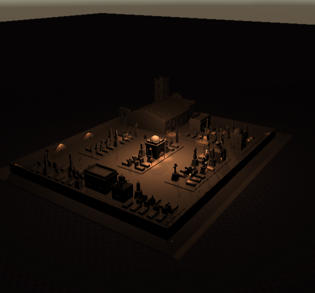

## CharacterSkillGameKit

**platform** - unity/mobile

**by** *sangko.deng*

------

#### **Scene example**

### Provide the following functions

- character controller

- camera controller

- skill system / vfx

